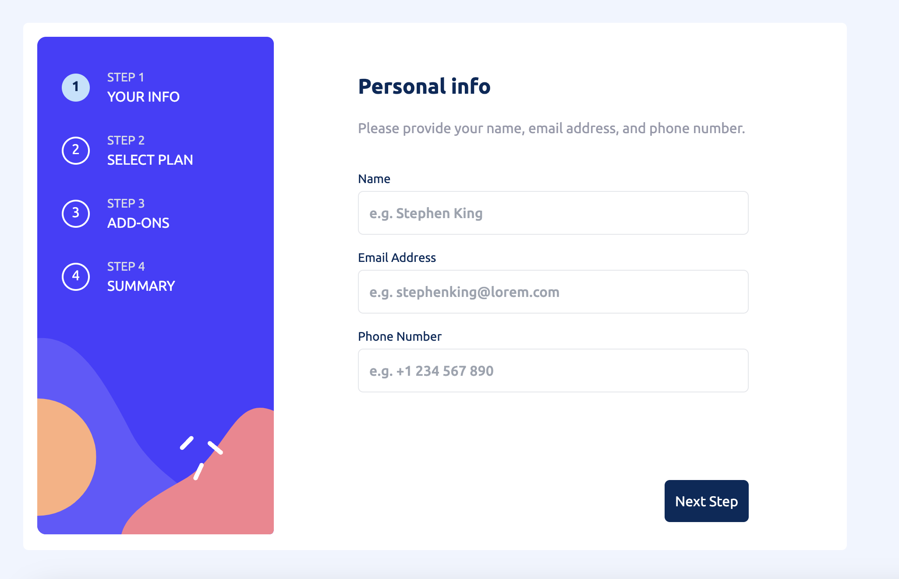
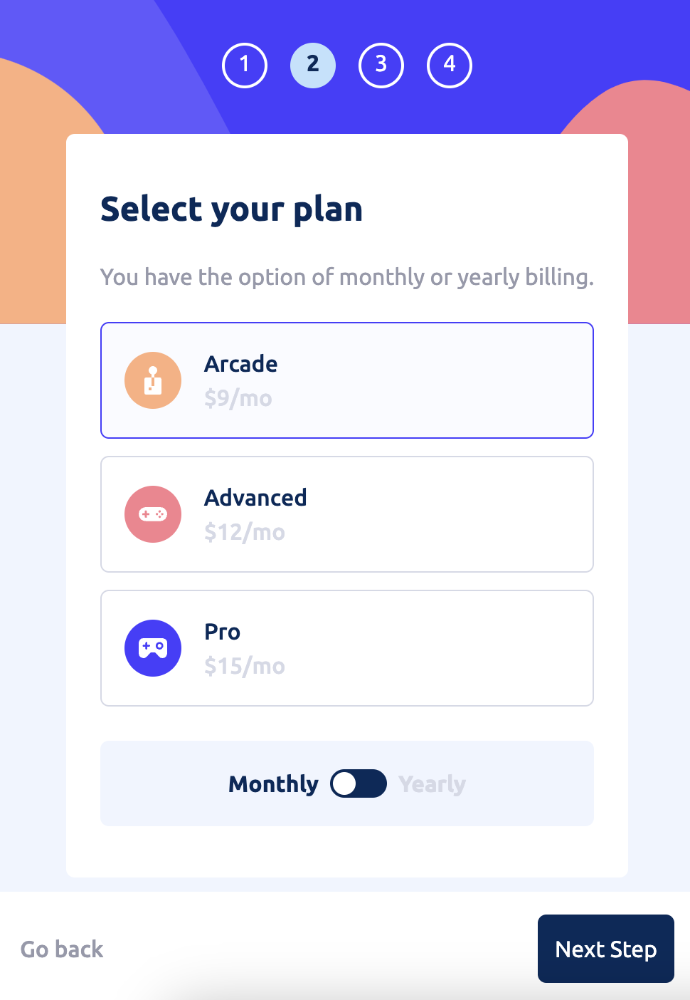

# Frontend Mentor - Multi-step form solution

This is a solution to the [Multi-step form challenge on Frontend Mentor](https://www.frontendmentor.io/challenges/multistep-form-YVAnSdqQBJ). Frontend Mentor challenges help you improve your coding skills by building realistic projects. 

## Table of contents

- [Overview](#overview)
  - [The challenge](#the-challenge)
  - [Screenshot](#screenshot)
  - [Links](#links)
- [My process](#my-process)
  - [Built with](#built-with)
  - [What I learned](#what-i-learned)
  - [Useful resources](#useful-resources)
- [Author](#author)

**Note: Delete this note and update the table of contents based on what sections you keep.**

## Overview

### The challenge

Users should be able to:

- Complete each step of the sequence
- Go back to a previous step to update their selections
- See a summary of their selections on the final step and confirm their order
- View the optimal layout for the interface depending on their device's screen size
- See hover and focus states for all interactive elements on the page
- Receive form validation messages if:
  - A field has been missed
  - The email address is not formatted correctly
  - A step is submitted, but no selection has been made

### Screenshot





### Links

- Live Site URL: [https://multi-step-form-three-rose.vercel.app/](https://multi-step-form-three-rose.vercel.app/)

## My process

### Built with

- TailwindCSS
- Flexbox
- Mobile-first workflow
- [React](https://reactjs.org/) - JS library
- [Next.js](https://nextjs.org/) - React framework
- [Formik](https://formik.org/) - For form management
- [Yup](https://github.com/jquense/yup) For the form validation


### What I learned

Understanding conditional rendering and form management was crucial for this project. Each part of the form is rendered based on what the current step is. The top/sidebar are also updating their apperance based on te current step. The other major challenge was to handle the form submission using a button outside of the scope of the Formik component. This was achieved by using the useRef Hook and the innerRef prop of the Formik API:


```js
const formRef = useRef<FormikProps<FormValues>>(null);
```

The responsiveness was achieved entirely using the built-in utilities of TailwindCSS.

## Author

- Website - [Angelo Ilardi](https://angelo-ilardi.vercel.app/)
- Frontend Mentor - [@angeloilardi](https://www.frontendmentor.io/profile/angeloilardi)

